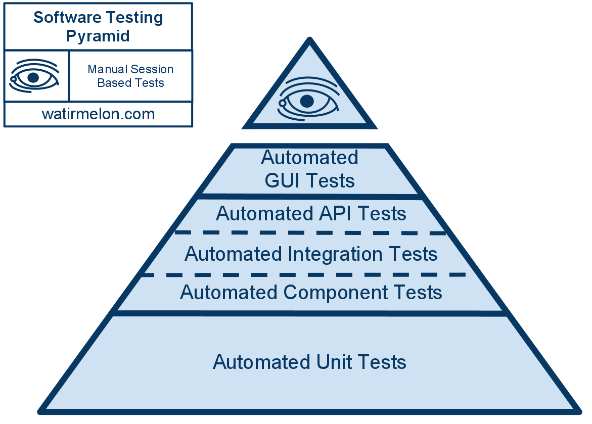
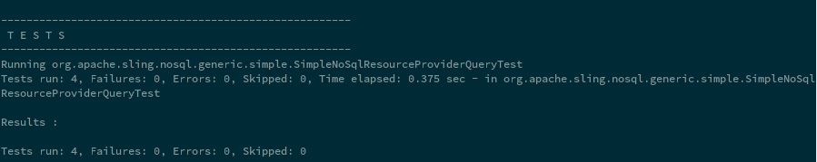
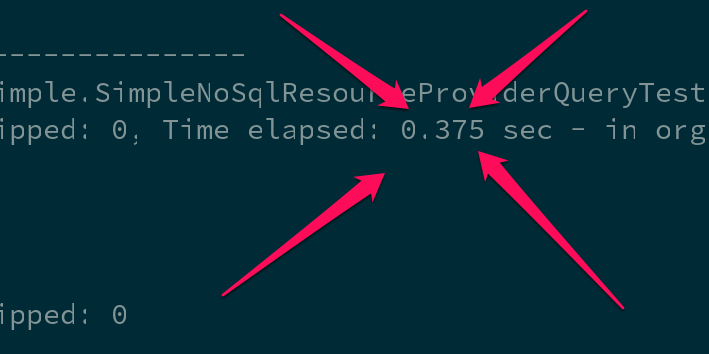
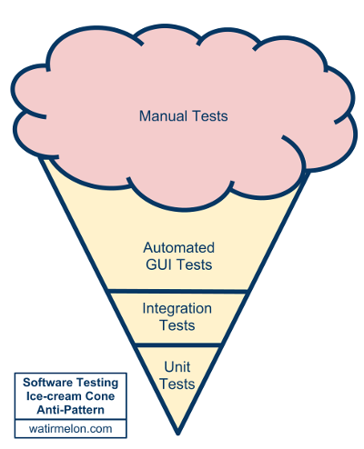

About the speaker
-------------------

* Apache Sling PMC member
* Long-time Open Source contributor
* Working with Adobe on AEM

Agenda
---------

* How do I test my application?
* What about Sling?
* Demo

How do I test my application?
===

Tools of the trade
---

* Unit testing
* Integration testing
* End-to-End testing

The testing pyramid
--

Unit testing
--

	@Test public void isNull() { 
	  assertThat( StringUtils.isNull( null ), is(true));
	}
	
Integration testing
--
 
    @Test public void persist() {
      MyDao dao = mock(MyDao.class);
      MyService service = new MyService(dao);
      service.persist(new ServiceObject()); // must not fail
    }

End-to-end testing
--

    @Test public void login() {
      Client client = new MyAppHttpClient();
      AuthResult result = client.login("admin", "admin");
      assertThat(result.isLoggedIn(), is(true));
    }
    
Testing tools galore
--

* Unit testing
    * Frameworks: JUnit, TestNG
    * Mocks: JMock, EasyMock, Mockito, Powermock
* Integration testing: Spring Testing, WireMock, Dumbster
* End-to-end testing: Selenium/WebDriver, REST-assured
    

What about Sling?
======

Sling oddities^W particularities
----

* OSGi
* JCR
* Sling APIs (Java, HTTP)

Unit testing with Sling
==

Unit testing
---

	@Test public void test_isRedirectValid_null_empty() {
        TestCase.assertFalse(AuthUtil.isRedirectValid(null, null));
        TestCase.assertFalse(AuthUtil.isRedirectValid(null, ""));
    }
    
Actual code from [AuthUtilTest.java](https://github.com/apache/sling/blob/e252fc651ab42037af0386bc4cd2b1fc26b13b7b/bundles/auth/core/src/test/java/org/apache/sling/auth/core/AuthUtilTest.java)

Unit testing with ad-hoc mocking
---

	
	@RunWith(JMock.class) public class AuthUtilTest {
      final Mockery context = new JUnit4Mockery();
      final ResourceResolver resolver = context.mock(ResourceResolver.class);
      final HttpServletRequest request = context.mock(HttpServletRequest.class);
      
      @Test public void test_isRedirectValid_invalid_characters() {
			context.checking(new Expectations() { /* code */ })
			TestCase.assertFalse(AuthUtil.isRedirectValid(request, "/illegal/</x"));
      }	        
    }

Actual code also from [AuthUtilTest.java](https://github.com/apache/sling/blob/e252fc651ab42037af0386bc4cd2b1fc26b13b7b/bundles/auth/core/src/test/java/org/apache/sling/auth/core/AuthUtilTest.java)

Unit testing with Sling mocks
---

	public class ModelAdapterFactoryUtilTest {
	
      @Test
      public void testRequestAttribute() {
        MockSlingHttpServletRequest request = new MockSlingHttpServletRequest();
        request.setAttribute("prop1", "myValue");
        RequestAttributeModel model = request.adaptTo(RequestAttributeModel.class);
        assertNotNull(model);
        assertEquals("myValue", model.getProp1());
      }
    }

Actual code from [ModelAdapterFactoryUtilTest.java](https://github.com/apache/sling/blob/e252fc651ab42037af0386bc4cd2b1fc26b13b7b/testing/mocks/sling-mock/src/test/java/org/apache/sling/testing/mock/sling/context/ModelAdapterFactoryUtilTest.java).
    
Unit testing OSGi code with Sling mocks
---

	public class ExampleTest {
	
	  @Rule
	  public final OsgiContext context = new OsgiContext();
	
	  @Test
	  public void testSomething() {
	
	    // register and activate service
	    MyService service1 = context.registerInjectActivateService(new MyService(),
	        ImmutableMap.<String, Object>of("prop1", "value1"));
	
	    // get service instance
	    OtherService service2 = context.getService(OtherService.class);
	
	  }
	
	}

Picked up from the [OSGi mocks documentation](https://sling.apache.org/documentation/development/osgi-mock.html).

Sling Mocks for unit testing
---

	public class SimpleNoSqlResourceProviderQueryTest {
    
      @Rule public SlingContext context = new SlingContext(ResourceResolverType.JCR_MOCK);
    
      @Before public void setUp() throws Exception {
        context.registerInjectActivateService(new SimpleNoSqlResourceProviderFactory(), ImmutableMap.<String, Object>builder()
                .put(ResourceProvider.ROOTS, "/nosql-simple")
                .build());
        
        // prepare some test data using Sling CRUD API ( not shown here )
    }

      @Test
      public void testFindResources_ValidQuery() {
        Iterator<Resource> result = context.resourceResolver().findResources("all", "simple");
        assertEquals("/nosql-simple", result.next().getPath());
        assertEquals("/nosql-simple/test", result.next().getPath());
        assertEquals("/nosql-simple/test/node1", result.next().getPath());
        assertEquals("/nosql-simple/test/node2", result.next().getPath());
        assertFalse(result.hasNext());
      }
    }
    
Code from [SimpleNoSqlResourceProviderQueryTest](https://github.com/apache/sling/blob/e252fc651ab42037af0386bc4cd2b1fc26b13b7b/contrib/nosql/generic/src/test/java/org/apache/sling/nosql/generic/simple/SimpleNoSqlResourceProviderQueryTest.java)

Sling Mocks for unit testing
---

Sling Mocks for unit testing
---

Testing JCR code with Sling mocks
---

    public class FindResourcesTest {

      @Rule public SlingContext context = new SlingContext(ResourceResolverType.JCR_MOCK);

      @Before public void setUp() {
        Resource resource = context.create().resource("test",
                ImmutableMap.<String, Object> builder().put("prop1", "value1")
                        .put("prop2", "value2").build());
		 // snip ...
        MockJcr.setQueryResult(session, Collections.singletonList(node));
    }

    @Test public void testFindResources() {
        Resource resource = context.resourceResolver().getResource("/test");
        Assert.assertNotNull("Resource with name 'test' should be there", resource);

        Iterator<Resource> result = context.resourceResolver().findResources("/test", Query.XPATH);
        Assert.assertTrue("At least one result expected", result.hasNext());
        Assert.assertEquals("/test", result.next().getPath());
        Assert.assertFalse("At most one result expected", result.hasNext());
      }
    }

The humble object pattern with OSGi
---
    public interface RouterAdmin {
	  void doStuff();
	}
	
	public class RouterAdminImpl implements RouterAdmin {
	  // constructor and field elided 
      public void doStuff() {
	    // implementation
	  }
	}
	
	@Component
	@Properties({ @Property(name="url") })
	public class RouterAdminComponent implements RouterAdmin() {
	  private RouterAdmin delegate;

      protected void activate(ComponentContext ctx) throws Exception {
        delegate = new RouterAdminImpl(new URL(requireString(ctx, "url")));
      }
      
      public void doStuff() {
        delegate.doStuff();
      }
	}

See [Humble Object at xUnit patterns](http://xunitpatterns.com/Humble%20Object.html) for more details.

Integration testing with Sling
==

Pax-Exam
--

    public abstract class AbstractJobHandlingTest {
    
      @Inject protected EventAdmin eventAdmin;

      @Inject protected ConfigurationAdmin configAdmin;

      @Inject protected BundleContext bc;
    
      @Configuration public Option[] config() {
        return options(
          frameworkProperty("sling.home").value(new File(...),
          mavenBundle("org.apache.sling", "org.apache.sling.fragment.xml", "1.0.2"),
          mavenBundle("org.apache.sling", "org.apache.sling.fragment.transaction", "1.0.0"),
          mavenBundle("org.apache.sling", "org.apache.sling.fragment.activation", "1.0.2"),
          mavenBundle("org.apache.sling", "org.apache.sling.fragment.ws", "1.0.2"),

          mavenBundle("org.apache.sling", "org.apache.sling.commons.log", "4.0.0"),
          mavenBundle("org.apache.sling", "org.apache.sling.commons.logservice", "1.0.2"),

          mavenBundle("org.slf4j", "slf4j-api", "1.6.4"),
          mavenBundle("org.slf4j", "jcl-over-slf4j", "1.6.4"),
          mavenBundle("org.slf4j", "log4j-over-slf4j", "1.6.4"),

          mavenBundle("commons-io", "commons-io", "1.4"),
          mavenBundle("commons-fileupload", "commons-fileupload", "1.3.1"),
          mavenBundle("commons-collections", "commons-collections", "3.2.1"),
          mavenBundle("commons-codec", "commons-codec", "1.9"),
          mavenBundle("commons-lang", "commons-lang", "2.6"),
          mavenBundle("commons-pool", "commons-pool", "1.6"),

          mavenBundle("org.apache.servicemix.bundles", "org.apache.servicemix.bundles.concurrent", "1.3.4_1"),

    	  // SNIP ...
    	  mavenBundle("org.apache.sling", "org.apache.sling.api", "2.8.0"),
          mavenBundle("org.apache.sling", "org.apache.sling.settings", "1.3.4"),
          mavenBundle("org.apache.sling", "org.apache.sling.resourceresolver", "1.1.6"),
          mavenBundle("org.apache.sling", "org.apache.sling.adapter", "2.1.2"),
		  // SNIP ...
	}
	
Sling mocks with a JCR backend
--

`ResourceResolverType.JCR_MOCK` ?

`JCR_OAK` or `JCR_JACKRABBIT` are also possible

Server-side JUnit tests
--

    @RunWith(SlingAnnotationsTestRunner.class)
    public class OsgiAwareTest {
    
      @TestReference private ConfigurationAdmin configAdmin;
      @TestReference private BundleContext bundleContext;
    
      @Test public void testConfigAdmin() throws Exception {
        assertNotNull( "Expecting ConfigurationAdmin to be injected by Sling test runner", configAdmin);        
      }
    }

Actual code from [OsgiAwareTest](https://github.com/apache/sling/blob/e252fc651ab42037af0386bc4cd2b1fc26b13b7b/testing/samples/sample-tests/src/main/java/org/apache/sling/testing/samples/sampletests/OsgiAwareTest.java)

Scriptable server-side tests
---

	%><sling:defineObjects/><%

    // we don't check for null etc to make the test fail if the service is not available!
    final InfoProvider ip = sling.getService(InfoProvider.class);
    final InstallationState is = ip.getInstallationState();

    String output = "";

    // check 01 : no untransformed resources
    if ( is.getUntransformedResources().size() > 0 ) {
        output += "Untransformed resources: " + is.getUntransformedResources() + "\n";
    }

    // check 02 : no active resources
    if ( is.getActiveResources().size() > 0 ) {
        output += "Active resources: " + is.getActiveResources() + "\n";
    }
    if ( output.length() > 0 ) {
        %><%= output %><%
    } else {
        %>TEST_PASSED<%
    }
	%>

Actual code from [installer-duplicate.jsp](https://github.com/apache/sling/blob/e252fc651ab42037af0386bc4cd2b1fc26b13b7b/launchpad/integration-tests/src/main/resources/scripts/sling-it/installer-duplicate.jsp).

End-to-end testing with Sling
==

HTTP utilities from the Sling testing tools
--

	public class HttpPingTest extends HttpTestBase {
      public void testWebServerRoot() throws Exception {
        // by default, the Launchpad default servlet redirects / to index.html
        final String url = HTTP_BASE_URL + "/";
        final GetMethod get = new GetMethod(url);
        get.setFollowRedirects(false);
        final int status = httpClient.executeMethod(get);
        assertEquals("Status must be 302 for " + url, 302, status);
        final Header h = get.getResponseHeader("Location");
        assertNotNull("Location header must be provided",h);
        assertTrue("Location header must end with index.html", h.getValue().endsWith("index.html"));
      }
    }
    
Final thoughts
-

* Sling provides a lot of specialised testing tools
* Lots of effort recently invested in the unit testing layer
* Experiment and provide feedback

And ensure your tests are properly structured 
-

