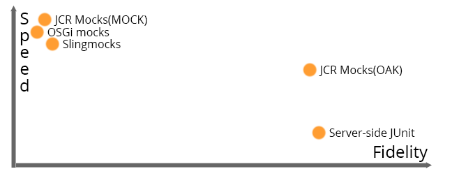

About the speaker
-------------------

* Apache Sling PMC member
* Long-time Open Source contributor
* Working with Adobe on AEM

Agenda
---------

* How do I test my application?
* What about Sling?
* Demo

How do I test my application?
===

Tools of the trade
---

* Unit testing
* Integration testing
* End-to-End testing

The testing pyramid
--

Unit testing
--

	@Test public void isNull() { 
	  assertThat(StringUtils.isNull(null), is(true));
	}
	
Integration testing
--
 
    @Test public void persist() {
      MyDao dao = mock(MyDao.class);
      MyService service = new MyService(dao);
      service.persist(new ServiceObject()); // must not fail
    }

End-to-end testing
--

    @Test public void login() {
      Client client = new MyAppHttpClient();
      AuthResult result = client.login("admin", "admin");
      assertThat(result.isLoggedIn(), is(true));
    }
    
Testing tools galore
--

* Unit testing
    * Frameworks: JUnit, TestNG
    * Mocks: JMock, EasyMock, Mockito, Powermock
* Integration testing: Spring Testing, WireMock, Dumbster
* End-to-end testing: Selenium/WebDriver, REST-assured
    

What about Sling?
======

Sling oddities^W particularities
----

* OSGi
* JCR
* Sling APIs (Java, HTTP)

Unit testing
---

	@Test public void test_isRedirectValid_null_empty() {
        TestCase.assertFalse(AuthUtil.isRedirectValid(null, null));
        TestCase.assertFalse(AuthUtil.isRedirectValid(null, ""));
    }
    
Actual code from [AuthUtilTest.java](https://github.com/apache/sling/blob/e252fc651ab42037af0386bc4cd2b1fc26b13b7b/bundles/auth/core/src/test/java/org/apache/sling/auth/core/AuthUtilTest.java)

Unit testing with ad-hoc mocking
---

	
	@RunWith(JMock.class) public class AuthUtilTest {
      final Mockery context = new JUnit4Mockery();
      final ResourceResolver resolver = context.mock(ResourceResolver.class);
      final HttpServletRequest request = context.mock(HttpServletRequest.class);
      
      @Test public void test_isRedirectValid_invalid_characters() {
			context.checking(new Expectations() { /* code */ })
			TestCase.assertFalse(AuthUtil.isRedirectValid(request, "/illegal/</x"));
      }	        
    }

Actual code also from [AuthUtilTest.java](https://github.com/apache/sling/blob/e252fc651ab42037af0386bc4cd2b1fc26b13b7b/bundles/auth/core/src/test/java/org/apache/sling/auth/core/AuthUtilTest.java)

Unit testing with Sling mocks
---

	public class ModelAdapterFactoryUtilTest {
	
      @Test
      public void testRequestAttribute() {
        MockSlingHttpServletRequest request = new MockSlingHttpServletRequest();
        request.setAttribute("prop1", "myValue");
        RequestAttributeModel model = request.adaptTo(RequestAttributeModel.class);
        assertNotNull(model);
        assertEquals("myValue", model.getProp1());
      }
    }

Actual code from [ModelAdapterFactoryUtilTest.java](https://github.com/apache/sling/blob/e252fc651ab42037af0386bc4cd2b1fc26b13b7b/testing/mocks/sling-mock/src/test/java/org/apache/sling/testing/mock/sling/context/ModelAdapterFactoryUtilTest.java).
    
Unit testing OSGi code with Sling mocks
---

	public class ExampleTest {
	
	  @Rule
	  public final OsgiContext context = new OsgiContext();
	
	  @Test
	  public void testSomething() {
	
	    // register and activate service
	    MyService service1 = context.registerInjectActivateService(new MyService(),
	        ImmutableMap.<String, Object>of("prop1", "value1"));
	
	    // get service instance
	    OtherService service2 = context.getService(OtherService.class);
	
	  }
	
	}

Picked up from the [OSGi mocks documentation](https://sling.apache.org/documentation/development/osgi-mock.html).

Sling Mocks for unit testing
---

	public class SimpleNoSqlResourceProviderQueryTest {
    
      @Rule public SlingContext context = new SlingContext(ResourceResolverType.JCR_MOCK);
    
      @Before public void setUp() throws Exception {
        context.registerInjectActivateService(new SimpleNoSqlResourceProviderFactory(), ImmutableMap.<String, Object>builder()
                .put(ResourceProvider.ROOTS, "/nosql-simple")
                .build());
        
        // prepare some test data using Sling CRUD API ( not shown here )
    }

      @Test
      public void testFindResources_ValidQuery() {
        Iterator<Resource> result = context.resourceResolver().findResources("all", "simple");
        assertEquals("/nosql-simple", result.next().getPath());
        assertEquals("/nosql-simple/test", result.next().getPath());
        assertEquals("/nosql-simple/test/node1", result.next().getPath());
        assertEquals("/nosql-simple/test/node2", result.next().getPath());
        assertFalse(result.hasNext());
      }
    }
    
Code from [SimpleNoSqlResourceProviderQueryTest](https://github.com/apache/sling/blob/e252fc651ab42037af0386bc4cd2b1fc26b13b7b/contrib/nosql/generic/src/test/java/org/apache/sling/nosql/generic/simple/SimpleNoSqlResourceProviderQueryTest.java)

Sling Mocks for unit testing
---

Sling Mocks for unit testing
---

Testing JCR code with Sling mocks
---

Testing JCR
---

* TransientRepository
* JCR Mocks

Testing Sling
---

* Sling Mocks
* Server-side JUnit tests
* HTTP-based integration tests

Comparison
---

