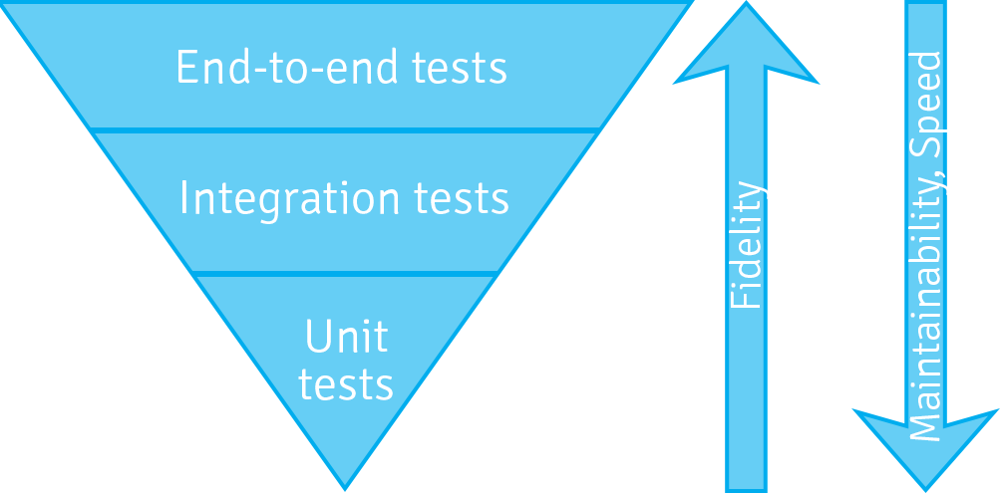

About the speaker
-------------------

* Apache Sling PMC member
* Long-time Open Source contributor
* Working with Adobe on AEM

<!--
Hello everyone and thanks for joining. My name is Robert Munteanu and this
is 'How do I test my Sling Application'..

A few words about myself - I am a PMC member in the Apache Sling project and
long-time Open Source contributor.

Also, I have been working for almost 4 years with Adobe in Romania on AEM.
So yes, it was still called CQ back then :-)

And obviously I care a lot about testing and code quality and this is why
I'm here. 
-->

Agenda
---------

* How do I test my application?
* What about Sling?
* Demo

<!--
First of all, to discuss how to test a Sling application we should quickly look
at how do we usually test web-based, data-driven applications.

Then we take these concepts and map them in detail to Apache Sling.

And in the end, we'll take a little time to look at an actual demo of putting the tools
and concepts I've discussed in action.
-->

Speaker.getInstance().interrupt()
===

<!--
Yes, please interrupt me whenever you have question or comment to make.
-->

How do I test my application?
===

<!--
For the purpose of this talk, I will only consider automatic testing of functionality. So no exploratory
testing, no performance testing, no UI-based testing.

I believe that there is great value and lots to be said about those topics, but that Sling-based
applications don't differ that much from other applications in order to justify a separate discussion.

Now that that's done with, let's get on with the concepts about testing
applications in general, to make sure that everyone is on the same page.
-->

Unit testing
--

	@Test public void isNull() { 
	  assertThat( StringUtils.isNull( null ), is(true));
	}
	
<!--
The first form of testing is of course unit testing. Unit tests should be
small, fast and self-contained. These tests validate that a unit - typically
a Java class works well in isolation.

This more or less applies to the 'Utils' family of classes, which don't collaborate
a lot. Which means that in application projects, as opposed to library projects, you
see a small proportion of these tests. In application projects most objects do have
collaborators.
-->
	
Unit testing with mocks
--
 
    @Test public void persist() {
      MyDao dao = mock(MyDao.class);
      MyService service = new MyService(dao);
      service.persist(new ServiceObject()); // must not fail
    }

<!--
And that obviously leads us to a well-known variation of unit test - a unit test
using mocks. Assuming that we have a database-backed application we can test
a service which uses a data access object. 

This trivial example shows how it would look like:

- the DAO is mocked
- the service gets an instance of the dao
- we invoke a method on the service and expect it to not fail

Some points to note here:

1. Mock-based tests work against a contract and not an implementation. We describe what
the collaborator should behave like - in our case that the dao should save the object that
was given to it without throwing an exception. We can even add a verify call to ensure that
the dao was called. But this is all us assuming that we know how the collaborator will behave.

2. Mock-based tests are still small, fast and self-contained. They do tend to
become a bit more verbose than 'plain' unit tests, but are still manageable.
-->

Unit testing with mocks
--
 
    @Test(expected=ServiceException.class) public void persist() {
      MyDao dao = mock(MyDao.class);
      MyService service = new MyService(dao);
      when(dao.persist(anyObject)).thenThrow(new DaoUnavailableException("mocked"));
      service.persist(new ServiceObject());
    }

Another twist to mocking - since we are in charge of the collaborator's
behaviour, we can simulate various conditions, like a collaborator
throwing an unchecked exception since the dao is - for instance - not able to 
connect to the data source. That can be tedious to arrange if not using mocks.

Integration testing
--
 
    @Test public void persist() {
      MyDao dao = new MyRealDao(/* config */);
      MyService service = new MyService(dao);
      service.persist(newServiceObject()); // must not fail
    }    

<!--
Integration tests, well, test integration between components. The two main 
differences between mock-based unit tests and integration tests are:

1. Integration tests are slower and typically require state management.

In our example we need to care whether MyRealDao persists its state or not, since that makes test
runs different. If newServiceObject() returns an identical object every time
a foreign key constraint violation might be thrown, so we need to ensure a clean slate ...
-->

Integration testing - clean slate
--
 
    @Before public void ensureCleanSlate() {
      MyDao dao = new MyRealDao(/* config */);
	  dao.deleteAll();
    }
    
<!--
Which we typically do with something like this - before running the test ensure
that we have no previous state. Of course, this can quickly get complicated
if you have multiple related entities so sometimes you simply do a drop/create
of the database. Which is obviously slower.

2. Integration tests works against the implementation, so they may uncover issues
which arise from the difference between contract and implementation.
-->

End-to-end testing
--

    @Test public void login() {
      Client client = new MyBrowserBasedClient();
      AuthResult result = client.login("admin", "admin");
      assertThat(result.isLoggedIn(), is(true));
    }
    
<!--
In the end ( no pun intended ) we have the big, bad, heavy, test-all end-to-end
tests. These typically simulate end-user interaction and exercise the complete
application in a realistic deployment scenario.

There's no point in wondering these tests are self-contained - they test
everything - from user interface to database access to how components are
wired. They are also the slowest of the bunch and are most realistic measure
of how your application will behave. And from my personal experience they're
quite flaky and require maintenance.

-->

Testing pyramid
--

<!--
So since you have all of these kinds of tests at your disposal, the question is
which should I write. The answer is all of them. Of course, there is no easy way
out. And then, the next question might come, where should I focus most of my effort.
As with all good questions, there is only one answer - it depends.

But I find that the testing pyramid is a good tool to help me decide where I would
focus my efforts. I've hinted that the different kinds of tests have different 
value propositions and different constraints. I like to order them by fidelity,
speed of execution and maintainability. By these criteria, unit tests have the least
fidelity when describing the state of the quality of your sistem, but they are
the most maintainable, and also the absolute fastest to execute.

By extension, for the same the development time, you will be able to run and maintain
much fewer integration or end-to-end tests compared to unit tests. So in terms of
raw efficiency, unit tests win. And as the pyramid suggests, add some integration
tests and some end-to-end tests to ensure that something doesn't slip by and you
have a pretty solid test battery for your application.
-->

... or the testing icecream cone? 
-

<!--
Now this is something I've also seen done, with good and bad parts. This is considered
an anti-pattern, but I'm not that dogmatic, and consider it just another approach, in
which the focus is on end-to-end tests, and much less on integration and end-to-end tests.
This usually happens when tests are 'retrofitted' to an existing application, and the
simplest thing to do is write a end-to-end test.

This may work for you, but note that you will have to invest a lot in maintaining these
tests - I know a good number of development teams that have invested a lot in end-to-end
tests and they almost never have a 100% successful testing run, and that's ok.
-->

What about Sling?
======

Unit testing with Sling
==

Unit testing
---

	@Test public void test_isRedirectValid_null_empty() {
        TestCase.assertFalse(AuthUtil.isRedirectValid(null, null));
        TestCase.assertFalse(AuthUtil.isRedirectValid(null, ""));
    }
    
Actual code from [AuthUtilTest.java](https://github.com/apache/sling/blob/e252fc651ab42037af0386bc4cd2b1fc26b13b7b/bundles/auth/core/src/test/java/org/apache/sling/auth/core/AuthUtilTest.java)

<!--
A very simple example of a unit test with no dependencies from the Sling code base
-->

Unit testing with ad-hoc mocking
---

	
	@RunWith(JMock.class) public class AuthUtilTest {
      final Mockery context = new JUnit4Mockery();
      final ResourceResolver resolver = context.mock(ResourceResolver.class);
      final HttpServletRequest request = context.mock(HttpServletRequest.class);
      
      @Test public void test_isRedirectValid_invalid_characters() {
			context.checking(new Expectations() { /* 8 lines of code */ })
			TestCase.assertFalse(AuthUtil.isRedirectValid(request, "/illegal/</x"));
      }	        
    }

Actual code also from [AuthUtilTest.java](https://github.com/apache/sling/blob/e252fc651ab42037af0386bc4cd2b1fc26b13b7b/bundles/auth/core/src/test/java/org/apache/sling/auth/core/AuthUtilTest.java)

<!--
This time the tests needs to interact with a ResourceResolver and
HttpServletRequest, so it mocks stuff. I've omitted the actual expectations since
it takes too much space, but we had a total of 8 lines of expectation code, which 
configure the context path and request attributes
-->

Unit testing with ad-hoc mocking
---

	context.checking(new Expectations() {
	    {
	        allowing(request).getContextPath();
	        will(returnValue("/ctx"));
	        allowing(request).getAttribute(with(any(String.class)));
	        will(returnValue(null));
	    }
	});

<!--
This is that the ad-hoc mocked code actually looks like, not rocket science, but
on the other hand it's a bit verbose.
-->

Unit testing with Sling mocks
---

	public class ModelAdapterFactoryUtilTest {
	
      @Test public void testRequestAttribute() {
        MockSlingHttpServletRequest request = new MockSlingHttpServletRequest();
        request.setAttribute("prop1", "myValue");
        RequestAttributeModel model = request.adaptTo(RequestAttributeModel.class);
        assertNotNull(model);
        assertEquals("myValue", model.getProp1());
      }
    }

Actual code from [ModelAdapterFactoryUtilTest.java](https://github.com/apache/sling/blob/e252fc651ab42037af0386bc4cd2b1fc26b13b7b/testing/mocks/sling-mock/src/test/java/org/apache/sling/testing/mock/sling/context/ModelAdapterFactoryUtilTest.java).

<!--
Another test, this time there is no framework-based mocking, but we're explicitly using a
MockSlingHttpServletRequest. I for one find this style code more natural, and reusing a pre-made
object also eliminates the potential for duplication throught the tests.

A quick note - there is an a rich vocabulary in the testing community regarding test object
semantics - what is a mock, what is a stub, what is a spy, but we generally regard our
test objects as mocks and name them consistently that way.
-->

OSGi
---

<!--

-->

Unit testing OSGi code with Sling mocks
---

	public class ExampleTest {
	
	  @Rule
	  public final OsgiContext context = new OsgiContext();
	
	  @Test
	  public void testSomething() {
	
	    // register and activate service
	    MyService service1 = context.registerInjectActivateService(new MyService(),
	        ImmutableMap.<String, Object>of("prop1", "value1"));
	
	    // get service instance
	    OtherService service2 = context.getService(OtherService.class);
	
	  }
	
	}

Picked up from the [OSGi mocks documentation](https://sling.apache.org/documentation/development/osgi-mock.html).

The humble object pattern with OSGi
---
    public interface RouterAdmin {
	  void doStuff();
	}
	
	public class RouterAdminImpl implements RouterAdmin {
	  // constructor and field elided 
      public void doStuff() {
	    // implementation
	  }
	}
	
	@Component
	@Properties({ @Property(name="url") })
	public class RouterAdminComponent implements RouterAdmin() {
	  private RouterAdmin delegate;

      protected void activate(ComponentContext ctx) throws Exception {
        delegate = new RouterAdminImpl(new URL(requireString(ctx, "url")));
      }
      
      public void doStuff() {
        delegate.doStuff();
      }
	}

See [Humble Object at xUnit patterns](http://xunitpatterns.com/Humble%20Object.html) for more details.

JCR
---

Testing JCR code with Sling mocks
---

    public class FindResourcesTest {

      @Rule public SlingContext context = new SlingContext(ResourceResolverType.JCR_MOCK);

      @Before public void setUp() {
        Resource resource = context.create().resource("test",
                ImmutableMap.<String, Object> builder().put("prop1", "value1")
                        .put("prop2", "value2").build());
		 // snip ...
        MockJcr.setQueryResult(session, Collections.singletonList(node));
    }

    @Test public void testFindResources() {
        Resource resource = context.resourceResolver().getResource("/test");
        Assert.assertNotNull("Resource with name 'test' should be there", resource);

        Iterator<Resource> result = context.resourceResolver().findResources("/test", Query.XPATH);
        Assert.assertTrue("At least one result expected", result.hasNext());
        Assert.assertEquals("/test", result.next().getPath());
        Assert.assertFalse("At most one result expected", result.hasNext());
      }
    }

Sling
--

Sling Mocks for unit testing
---

	public class SimpleNoSqlResourceProviderQueryTest {
    
      @Rule public SlingContext context = new SlingContext(ResourceResolverType.JCR_MOCK);
    
      @Before public void setUp() throws Exception {
        context.registerInjectActivateService(new SimpleNoSqlResourceProviderFactory(), ImmutableMap.<String, Object>builder()
                .put(ResourceProvider.ROOTS, "/nosql-simple")
                .build());
        
        // prepare some test data using Sling CRUD API ( not shown here )
    }

      @Test
      public void testFindResources_ValidQuery() {
        Iterator<Resource> result = context.resourceResolver().findResources("all", "simple");
        assertEquals("/nosql-simple", result.next().getPath());
        assertEquals("/nosql-simple/test", result.next().getPath());
        assertEquals("/nosql-simple/test/node1", result.next().getPath());
        assertEquals("/nosql-simple/test/node2", result.next().getPath());
        assertFalse(result.hasNext());
      }
    }
    
Code from [SimpleNoSqlResourceProviderQueryTest](https://github.com/apache/sling/blob/e252fc651ab42037af0386bc4cd2b1fc26b13b7b/contrib/nosql/generic/src/test/java/org/apache/sling/nosql/generic/simple/SimpleNoSqlResourceProviderQueryTest.java)

Sling Mocks for unit testing
---

Sling Mocks for unit testing
---

Integration testing with Sling
==

Pax-Exam
--

    public abstract class AbstractJobHandlingTest {
    
      @Inject protected EventAdmin eventAdmin;

      @Inject protected ConfigurationAdmin configAdmin;

      @Inject protected BundleContext bc;
    
      @Configuration public Option[] config() {
        return options(
          frameworkProperty("sling.home").value(new File(...),
          mavenBundle("org.apache.sling", "org.apache.sling.fragment.xml", "1.0.2"),
          mavenBundle("org.apache.sling", "org.apache.sling.fragment.transaction", "1.0.0"),
          mavenBundle("org.apache.sling", "org.apache.sling.fragment.activation", "1.0.2"),
          mavenBundle("org.apache.sling", "org.apache.sling.fragment.ws", "1.0.2"),

          mavenBundle("org.apache.sling", "org.apache.sling.commons.log", "4.0.0"),
          mavenBundle("org.apache.sling", "org.apache.sling.commons.logservice", "1.0.2"),

          mavenBundle("org.slf4j", "slf4j-api", "1.6.4"),
          mavenBundle("org.slf4j", "jcl-over-slf4j", "1.6.4"),
          mavenBundle("org.slf4j", "log4j-over-slf4j", "1.6.4"),

          mavenBundle("commons-io", "commons-io", "1.4"),
          mavenBundle("commons-fileupload", "commons-fileupload", "1.3.1"),
          mavenBundle("commons-collections", "commons-collections", "3.2.1"),
          mavenBundle("commons-codec", "commons-codec", "1.9"),
          mavenBundle("commons-lang", "commons-lang", "2.6"),
          mavenBundle("commons-pool", "commons-pool", "1.6"),

          mavenBundle("org.apache.servicemix.bundles", "org.apache.servicemix.bundles.concurrent", "1.3.4_1"),

    	  // SNIP ...
    	  mavenBundle("org.apache.sling", "org.apache.sling.api", "2.8.0"),
          mavenBundle("org.apache.sling", "org.apache.sling.settings", "1.3.4"),
          mavenBundle("org.apache.sling", "org.apache.sling.resourceresolver", "1.1.6"),
          mavenBundle("org.apache.sling", "org.apache.sling.adapter", "2.1.2"),
		  // SNIP ...
	}
	
Sling mocks with a JCR backend
--

`ResourceResolverType.JCR_MOCK` ?

`JCR_OAK` or `JCR_JACKRABBIT` are also possible

Server-side JUnit tests
--

    @RunWith(SlingAnnotationsTestRunner.class)
    public class OsgiAwareTest {
    
      @TestReference private ConfigurationAdmin configAdmin;
      @TestReference private BundleContext bundleContext;
    
      @Test public void testConfigAdmin() throws Exception {
        assertNotNull( "Expecting ConfigurationAdmin to be injected by Sling test runner", configAdmin);        
      }
    }

Actual code from [OsgiAwareTest](https://github.com/apache/sling/blob/e252fc651ab42037af0386bc4cd2b1fc26b13b7b/testing/samples/sample-tests/src/main/java/org/apache/sling/testing/samples/sampletests/OsgiAwareTest.java)

Scriptable server-side tests
---

	%><sling:defineObjects/><%

    // we don't check for null etc to make the test fail if the service is not available!
    final InfoProvider ip = sling.getService(InfoProvider.class);
    final InstallationState is = ip.getInstallationState();

    String output = "";

    // check 01 : no untransformed resources
    if ( is.getUntransformedResources().size() > 0 ) {
        output += "Untransformed resources: " + is.getUntransformedResources() + "\n";
    }

    // check 02 : no active resources
    if ( is.getActiveResources().size() > 0 ) {
        output += "Active resources: " + is.getActiveResources() + "\n";
    }
    if ( output.length() > 0 ) {
        %><%= output %><%
    } else {
        %>TEST_PASSED<%
    }
	%>

Actual code from [installer-duplicate.jsp](https://github.com/apache/sling/blob/e252fc651ab42037af0386bc4cd2b1fc26b13b7b/launchpad/integration-tests/src/main/resources/scripts/sling-it/installer-duplicate.jsp).

End-to-end testing with Sling
==

HTTP utilities from the Sling testing tools
--

	public class HttpPingTest extends HttpTestBase {
      public void testWebServerRoot() throws Exception {
        // by default, the Launchpad default servlet redirects / to index.html
        final String url = HTTP_BASE_URL + "/";
        final GetMethod get = new GetMethod(url);
        get.setFollowRedirects(false);
        final int status = httpClient.executeMethod(get);
        assertEquals("Status must be 302 for " + url, 302, status);
        final Header h = get.getResponseHeader("Location");
        assertNotNull("Location header must be provided",h);
        assertTrue("Location header must end with index.html", h.getValue().endsWith("index.html"));
      }
    }

Code time
==

Slingshot
--

    
Colophon
--

* Presentation crafted with Eclipse, GNU Make and [odpdown](https://github.com/thorstenb/odpdown)
* Photo credits
  * [Slingshots](https://www.flickr.com/photos/81325557@N00/8948946827) by _Anne and Tim_ on Flickr
  * [Wall](https://www.flickr.com/photos/bartoszjanusz/6344746584/) by _Bart Lumber_ on Flickr
  * [Oak (May)](https://www.flickr.com/photos/robwatling/3500885002) by _Rob Watling_ on Flickr
  * [HTML code](https://www.flickr.com/photos/nikio/3899114449) by _Marjan Krebelj_ on Flickr

Final thoughts
--

* Sling provides a lot of specialised testing tools
* Lots of effort recently invested in the unit testing layer
* Experiment and provide feedback